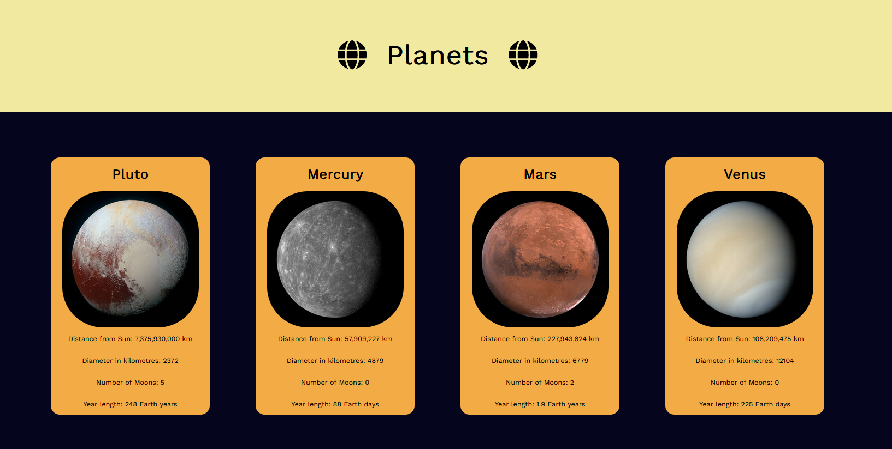

# Planet Cards App (MVP achieved, unfinished)

An adaptation of a planet cards app I made during my time at \_nology displaying the planets in order.

## MVP

-   Display the planets in individual cards, passing down information from a JS planets object
-   Display an image, the title and several pieces of information contained within the object
-   Display cards in a grid (preferably responsive)
-   Stack: React, HTML, SCSS

## To Do:

-   RESPONSIVENESS - needs to work on narrower screens, down to approximately 350px wide.
-   Routing: link planet cards to individual planet pages.
-   Hover and click colour effects for cards
-   Hover animations for hover on globe FA icons
-   Change header and footer colours

## Styling

I wanted the background to be reminiscent of a night sky, with deep navy blues and bright yellow for each planet. The header and the footer were initially designed to reflect this same starry yellow colour but I will be changing them to more peachy and red tones to reflect sunrise and sunset and the top and bottom (i.e. beginning and end) of the day.
